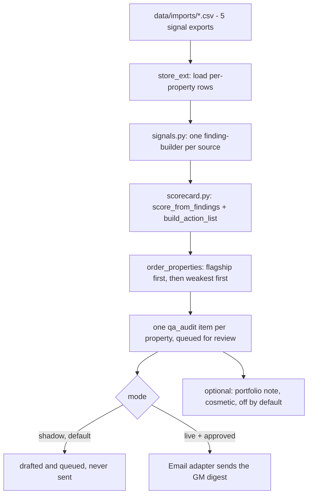

# Guest Journey QA AI - "The Inspector"

Walks the guest journey the way a mystery shopper would, property by
property: website and booking flow, OTA listings, pre-arrival comms, review
themes, and room-readiness signals from housekeeping data. Scores each
property against your brand standard and sends every GM a prioritised fix
list.

Clone this repo, open Claude Code inside it, and your own Claude session
sets it up and runs it. It knows nothing about the company that built this
template - everything it needs is in this folder.

## What it does

**Does.** Walks the guest journey the way a mystery shopper would, property
by property: website and booking flow, OTA listings, pre-arrival comms,
review themes, and room-readiness signals from housekeeping data. Scores
each property against your brand standard and sends every GM a prioritised
fix list.

**Won't.** Scores and reports; fixing is for the GM (or the other agents).
Physical inspections still need human eyes - it covers everything digital
and everything the data can see.

**Why.** Standards drift silently across a portfolio. This gives every GM a
consistent, objective QA pass every week instead of an annual audit.

**What to expect.** Every property scored on the same yardstick weekly,
with a ranked fix list per GM.

**Roughly what it's worth.** +8% on brand-standard scores, in the source
material's own estimate. Treat that as directional, not a guarantee for
your property - see `docs/benefits.md` for how to measure your own numbers,
and for the honest caveat that this template does not itself close the
loop on whether a flagged action actually got fixed.

A note on the promise, up front, because this README will not repeat a
claim the code cannot back up: **the audit is real, but two of the five
signals need you (or your Claude session) to feed them.** Room-readiness,
pre-arrival comms and review themes score from data you export as a CSV.
OTA listing parity and booking-flow timing need either a manual weekly
check or a small script - there is no crawler bundled with this template.
See `docs/integrations.md` for exactly what each of the five needs, and
`docs/how-it-works.md` for the full design reasoning.

A note on distribution, too: the roster promise says this agent "sends
every GM a prioritised fix list" and it does, once you approve it - like
every agent in this family, nothing is sent while `mode: shadow` (the
default), and even in `mode: live` a human approves each digest before it
goes out.

## Who it's for

A hotel group, or a single property, that wants a consistent weekly QA pass
instead of an annual mystery-shopper visit. It assumes:

- You can get the five weekly signals into a CSV (from your housekeeping
  system, your PMS, your review platform, or a manual check) - or you are
  comfortable asking your Claude session to script one of them
  (`docs/integrations.md`).
- You have a GM (or a group ops person) per property who reads a weekly
  digest and acts on the fix list - this agent scores and reports; it never
  fixes anything itself.
- You are not expecting a live website crawler out of the box. Booking-flow
  timing and OTA listing checks are the two signals that need the most
  setup - see the note above.

## How it works



Every score and every action is deterministic arithmetic over the data you
gave it - see `docs/how-it-works.md` for the exact rubric (a category
starts at 100, a `high` finding costs 9 points, `medium` costs 4, `low`
costs 2, `praise` costs nothing) and for why properties are ordered
flagship-first, then weakest-overall-first.

**The two modes.**

| Mode | What happens |
|---|---|
| `shadow` (default) | Scores, drafts a GM digest, queues it. Never sends. |
| `live` | An approved digest is really emailed to its GM. Everything else still waits. |

**What runs when.**

| Workflow | Cadence | Provider used |
|---|---|---|
| `workflows/10-qa-audit.md` (the main loop) | weekly (`config/agent.yaml: schedule.audit`) | `mock` in `make demo`; whatever `llm.provider` is set to for the optional portfolio note (skipped entirely on `interactive`) |
| `workflows/80-review.md` | as needed, whenever a digest is queued | none |
| `workflows/90-go-live.md` | once | none |

`make schedule ARGS="--all"` prints the snippet for the job above - see
"Run it" below for the literal output.

**Sub-agents:** none. The roster gives this agent no children.

## What you need

| What | For | Time |
|---|---|---|
| Nothing | The 5-minute quick start below, on bundled fixtures | 5 min |
| A weekly export from your housekeeping/PMS system | `data/imports/room_status.csv` | varies by system |
| A weekly export of pre-arrival sends | `data/imports/journey_touchpoints.csv` | varies by system |
| A monthly review export (Google/Booking.com/TripAdvisor/Vrbo) | `data/imports/reviews.csv` | 10 min |
| A manual or scripted OTA listing comparison | `data/imports/ota_listings.csv` | 15 min manual, or a script once |
| A manual or scripted booking-flow timed run | `data/imports/booking_flow_checks.csv` | 15 min manual, or a script once |
| A mailbox (IMAP or Gmail), to send digests in live mode | `systems.email.adapter` | 10 min |
| A Claude Code subscription, or an Anthropic API key | the optional portfolio note only - everything else needs neither | - |

You do not need all five signals to start. A property with fewer than five
imported this week still gets scored on what is there, with a coverage
warning on whatever is missing - see `docs/how-it-works.md`.

## Quick start (5 minutes, no credentials)

```bash
git clone https://github.com/th1-ai/guest-journey-qa-ai.git guest-journey-qa-ai
cd guest-journey-qa-ai
make setup
make demo
```

You should see something close to this (exact scores and item ids will
differ run to run only if you edit the fixtures - the bundled ones are
fixed):

```
Guest Journey QA AI demo - 4 properties in the portfolio, flagship first then weakest overall

[info ] queued item_id=... property=aurora-city overall=100 status=pending_review
[info ] queued item_id=... property=aurora-ridge overall=90 status=pending_review
[info ] queued item_id=... property=aurora-bay overall=97 status=pending_review
[info ] queued item_id=... property=marlow-house overall=100 status=pending_review
  Hotel Aurora           overall=100/100 (teal)  0 action(s)  status=pending_review
  Aurora Ridge Lodge     overall= 90/100 (teal)  10 action(s)  status=pending_review
  Aurora Bay Inn         overall= 97/100 (teal)  5 action(s)  status=pending_review
  The Marlow House       overall=100/100 (teal)  0 action(s)  status=pending_review

0 of 4 property digest(s) need a person to look first (no GM contact configured, or no signal data - see docs/safety.md).
Nothing was sent: mode is shadow, and demo never calls send() at all.
Next: `make review` to see a digest, or read workflows/10-qa-audit.md.

DEMO OK — 4 items processed, 4 drafted, 0 sent (shadow)
```

Notice Hotel Aurora (the flagship) sorts first regardless of score, then
the rest sort weakest-overall-first - Aurora Ridge Lodge, this template's
intentionally weak property, is second and carries the most actions. That
ordering is the point: see `docs/how-it-works.md` "Portfolio ordering".

Try the review queue next:

```bash
make review
python3 tools/review.py show <id>
```

Nothing you do here sends anything - `make demo` runs entirely on
`fixtures/inbound/signals/*.json` and the `mock` LLM provider, and never
touches your real config or a live mailbox.

### What a digest actually looks like

Aurora Ridge Lodge's digest from the bundled fixtures, trimmed to the top
few findings and actions - this is real output from `tools/scorecard.py`,
not an example written by hand:

```
# Aurora Ridge Lodge - Weekly QA scorecard

**2026-W35** · Aurora Hospitality Group

## Overall: 90/100 (teal)

## Scores by category
- Arrival: 87/100 (blue)
- Room: 91/100 (teal)
- Brand standards: 80/100 (amber)
...

## Findings
- **Room** (high): 3 of 5 room(s) checked were not guest-ready by 15:00 (for example room 303).
- **Arrival** (high): 2 of 2 "booking_confirmation" message(s) were never sent this week.
- **Brand standards** (high): Google lists opening_hours as "Reception 24h", not "Reception 07:00-23:00".
...

## Action list
- [ ] Fix: 3 of 5 room(s) checked were not guest-ready by 15:00 (for example room 303). - **Executive Housekeeper** · due This week
- [ ] Fix: 2 of 2 "booking_confirmation" message(s) were never sent this week. - **Front Office Manager** · due This week
- [ ] Fix: Google lists opening_hours as "Reception 24h", not "Reception 07:00-23:00". - **Marketing Lead** · due This week
...
```

Every line traces back to a row you (or your script) put in
`data/imports/`. Nothing here is a model's summary of anything - see
`docs/how-it-works.md` for the exact arithmetic behind every number.

## Set up with Claude Code

Open `claude` in this folder for each phase and paste the prompt. Each
phase names the workflow file Claude will follow.

**Phase 1 - first run.**
> Read `workflows/00-setup.md` and walk me through it: run `make setup` and
> `make demo`, then help me fill in `config/hotel.yaml`,
> `config/agent.yaml`'s `properties` list and `group_name`, and `knowledge/`.

**Phase 2 - connect your signals.**
> Read `docs/integrations.md`. I want to connect [room_status.csv /
> journey_touchpoints.csv / reviews.csv / ota_listings.csv /
> booking_flow_checks.csv]. My source system is [name it]. Walk me through
> getting the export into the right shape and dropping it in
> `data/imports/`.

**Phase 3 - run it for real.**
> Read `workflows/10-qa-audit.md`. Run `python3 tools/run.py --once`, show
> me what it scored, and read the findings and action list back to me in
> plain language before I decide anything.

**Phase 4 - review and decide.**
> Read `workflows/80-review.md`. Show me what is waiting in the review
> queue and help me approve, edit or reject each one.

**Phase 5 - go live, when ready.**
> Read `workflows/90-go-live.md` and walk me through the checklist. Do not
> flip `mode` to `live` until every item on it is genuinely true.

## Connect your systems

The audit itself does not go through `core/adapters` at all - the five
signals are CSV imports, loaded straight into `data/agent.db` by
`tools/store_ext.py`. `core/adapters` is used for exactly one thing: sending
the GM digest.

| System | Status | Needs | Test |
|---|---|---|---|
| The five signal CSVs | universal | nothing - drop files in `data/imports/` | `make doctor` shows the row count it found in each |
| Email (`systems.email.adapter`) | `mock` demo / `imap` universal / `gmail` built | a mailbox, for real sends | `make doctor` |
| Sheets (`systems.sheets.adapter`) | `csv` universal / `google` built | nothing / a service account | `python3 tools/report.py --export` |
| PMS, Messaging | configured, not used by this agent | - | `make doctor` still pings them |

Full detail, exact CSV columns, and the "implement your own" recipe for
scripting the OTA-listing check or the booking-flow timer:
`docs/integrations.md`.

## Run it

```bash
python3 tools/run.py --once                    # every property, whatever is due
python3 tools/run.py --once --property aurora-ridge   # just one
python3 tools/run.py --once --force              # recompute this week's scorecard
python3 tools/run.py --once --dry-run            # preview, write nothing (never imports data/imports/ - see below)
python3 tools/run.py --watch                     # loop on poll_seconds
```

`python3 tools/review.py list` shows what is waiting; `show <id>`,
`approve <id>`, `edit <id> --body-file <path>`, `reject <id> --reason "..."`
and `send` work the queue - see `workflows/80-review.md`.

**Scheduling.** `make schedule ARGS="--all"` prints one snippet per job in
`config/agent.yaml: schedule` for cron, launchd (Mac) or systemd (Linux/VPS):

```bash
make schedule ARGS="--all"
# job: audit  cadence: weekly  (from config/agent.yaml schedule.audit)
# 0 6 * * 1 cd /path/to/guest-journey-qa-ai && .venv/bin/python tools/run.py --once >> data/logs/cron.log 2>&1
```

(the exact command depends on `--target cron|launchd|systemd`; see
`scheduler/crontab.example`, `scheduler/launchd.example.plist`,
`scheduler/systemd.example.service` + `scheduler/systemd.example.timer` for ready-to-edit files.)

**Subscription vs. API.** The only reasoning step in this whole agent is
the optional portfolio note. On `llm.provider: interactive` or
`claude-code`, it costs nothing beyond your existing Claude Code
subscription (and on `interactive` it is skipped entirely, never pending -
see `docs/how-it-works.md`). Automated use of a personal Pro/Max
subscription is still subject to Anthropic's usage policy and rate limits;
for anything beyond a weekly cosmetic note, that is not a concern here. For
production volume, `llm.provider: anthropic` with your own API key gives you
proper rate limits and attributable spend - `make report` shows what you
are spending, which for this agent should stay near zero.

## Go live

`workflows/90-go-live.md` has the full checklist. In short: the flagship's
real identity in `config/hotel.yaml`, every real property with a real
`gm_email` in `config/agent.yaml`, `knowledge/` filled in, at least one real
week of scorecards reviewed, a real mailbox connected, then:

```bash
python3 tools/review.py stale   # clear the shadow-era backlog first
```
```yaml
# config/hotel.yaml
mode: live
```

Going live means an **approved** digest actually gets emailed the next time
`python3 tools/review.py send` runs. It does not mean digests start sending
themselves - `review.require_approval_for` still lists `send_email` by
default, and nothing in this repo changes that.

## Guardrails & safety

- **Shadow blocks every send, approved or not.** `mode: shadow` is a global
  kill switch enforced in `core/review.py` (`assert_write_allowed`) - there is
  no config combination that sends while shadow is on.
- **Scores and reports; never fixes.** `tools/scorecard.py` has no write
  method for any operational system. The only write in this repo is the GM
  digest email.
- **A `praise` finding is never actioned**, and an action always has an
  owner (falling to General Manager when the area is unmapped) and a due
  label (`This week` for `high`, `This month` otherwise).
- **A category with no signal this week scores 100 with a warning, never a
  guess.** See `docs/how-it-works.md` "Scoring rubric".
- **`--dry-run` writes nothing**, not even in `live` mode - and it never
  imports `data/imports/*.csv` either (that write counts too), so it
  previews whatever `data/agent.db` already holds and says so on screen. On
  a fresh, never-imported database that preview is a flat 100/100 for every
  property - a placeholder, not a real score. Run once without `--dry-run`
  first to see real numbers.
- **Card numbers are redacted on the way in**, on the one free-text field
  this agent reads (`data/imports/reviews.csv`'s `text` column) - see `docs/safety.md`.
- **No guest-facing text at all.** This agent never messages a guest; its
  output is a staff-facing digest. See `docs/safety.md` "AI transparency,
  in practice" for what that means for the EU AI Act Article 50 disclosure.

Full detail: `docs/safety.md`.

## Customising

**The portfolio.** `config/agent.yaml: properties` - add, remove or rename a
property. `flagship` picks which one always sorts first. Ids are half the
idempotency key, so do not rename an id once you have run a real audit
against it - add a new one instead. `group_name` is the portfolio's own
name, printed at the top of every property's digest - it is not
`hotel.yaml: hotel.name`, which is only the flagship's own guest-facing
name.

**The score categories and owner map.** `config/agent.yaml: score_categories`
and `owners` - re-label the six fixed categories, or repoint an area to a
different owner. This is how you adapt the whole agent to a restaurant
lens without touching a line of Python: rename the categories to something
like `booking`, `arrival`, `food`, `service`, `presence`, and point `owners`
at Head Chef / Floor Manager / Marketing instead.

**The collector thresholds.** `config/agent.yaml: signals` - `ready_by`,
`late_tolerance_hours`, `window_days`, `min_count_for_theme`,
`low_rating_threshold`, `high_impact_fields`, `default_max_seconds`. Change
a number, re-run with `--force`, and read the new finding - every threshold
here is meant to be provable, never a black box.

**The deduction table.** `tools/scorecard.py` (`DEDUCTIONS`) - how many points a
`high`/`medium`/`low` finding costs its category. Not exposed in YAML on
purpose (it changes what "100" means portfolio-wide); ask your Claude
session to change it if your hotel wants harsher or gentler scoring.

**The digest wording.** `tools/scorecard.py` (`render_digest_md`) builds the
email body; `knowledge/signature.md` is the sign-off, appended
automatically to every send.

**Adding a language.** This agent has no guest-facing text and does not
detect language at all - the GM digest is always written in whatever
language you write `knowledge/signature.md` and your own edits in. There is
nothing to add here.

## Troubleshooting & FAQ

Full list: `workflows/99-troubleshooting.md`. The most common ones:

**`make demo` does not print `DEMO OK`.** Run `make setup` first
(`.venv` must exist). If it still fails, read the traceback - `tools/demo.py`
does not swallow errors.

**A property is always `needs_human`.** Either its `gm_email` is blank in
`config/agent.yaml`, or none of the five `data/imports/*.csv` files had a
row for it this week. Both reasons print on the scorecard's `warnings`.

**`make run` says "0 items processed... N skipped".** Not an error - this
week's scorecard already exists for every property. The full text is two
lines: `0 items processed, 0 drafted, 0 sent (shadow)` then `N skipped -
already scored this week for those properties. Pass --force to recompute.`
Pass `--force` to recompute.

**A score does not look right.** Read the `findings` on that item
(`python3 tools/review.py show <id>`), then check the matching threshold in
`config/agent.yaml: signals`. See "Customising" above.

## Measuring the benefit

```bash
make report
python3 tools/report.py --export   # also writes data/exports/qa_report.csv
```

Shows the portfolio average overall score, total actions raised, how many
properties are stuck `needs_human`, the edit rate on digests you have
reviewed, and the LLM spend (near-zero - the only call is the cosmetic
portfolio note). Full detail, what to track over time, and the honest
caveats behind the roster's "+8%" claim: `docs/benefits.md`.

## About

Built by [TH1](https://th1.ai), an AI agency for independent hotels and
small groups. This repo is free and open source (MIT) - clone it, run it on
your own Claude Code subscription or API key, and change anything you like.
No TH1 infrastructure is involved anywhere in this template.

Want it running without touching a terminal? TH1 will set this up, connect
your real systems, and keep it tuned - [th1.ai](https://th1.ai).

**Licence:** MIT, see `LICENSE`.

**Changelog:** this is the first published version of this template.
