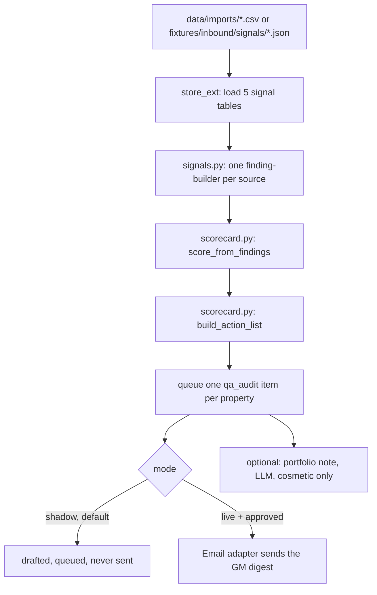

# How it works

## What this agent is

Guest Journey QA AI ("The Inspector") is a mystery-shopper for your whole
portfolio. Once a week it reads whatever your systems can tell it about the
guest journey at each property — pre-arrival messages sent, rooms turned
around, reviews received, OTA listing content, the booking flow — turns that
into a scorecard and a findings list per property, and drafts a fix list for
each property's GM.

**The scoring is deterministic. Nothing here calls a model to decide
anything.** Every score, every finding and every action comes from plain
rules over real data, so a number can always be explained back in one line:
"Room: 100 - 4 (one medium finding: two rooms not ready by 15:00) = 96."
The only optional model call is a cosmetic paragraph on top of a finished
run (see "The one LLM call" below) — it is never in the decision path.

This mirrors the source demo it is built from: `reputation-engine.ts`'s
`buildActionList()` is deterministic and is ported here almost line for
line (see "Porting `buildActionList`" below). The scores and findings
themselves were seeded rows in that demo — not the output of a working
audit. This template closes that gap: it reads real per-property signals
and computes real scores, because a "concept"-stage agent that ships to a
hotel needs the audit to actually run. Every design decision that fills that
gap is recorded below.

## The loop

## The five signals

The roster promise names five inputs. All five are implemented as
**universal CSV imports** into `data/imports/` (a hotel's own exports, or
data another script writes there) — no crawler, no live API, so the whole
loop works offline on `fixtures/` with zero credentials. Each has one
finding-builder in `tools/signals.py`:

| Signal (roster promise) | Import file | Finding-builder | Feeds category |
|---|---|---|---|
| Room-readiness from housekeeping data | `room_status.csv` | `room_readiness_findings` | `room` |
| Pre-arrival comms | `journey_touchpoints.csv` | `touchpoint_findings` | `arrival` |
| Review themes | `reviews.csv` | `review_theme_findings` | `fnb` / `spa` / `service` / `room` / `arrival` / `brand` (whatever `category` the row carries) |
| OTA listings | `ota_listings.csv` | `ota_listing_findings` | `brand` |
| Website and booking flow | `booking_flow_checks.csv` | `booking_flow_findings` | `booking` (an extra key — see "The open score schema") |

Every function is a pure function: rows in, `list[Finding]` out. No I/O, no
model, no randomness — see `tests/test_qa_signals.py`.

## Scoring rubric (design decision — spec open question #10)

The source demo's `overall` and per-category scores were opaque numbers
with, in the words of the behavioural spec, "no trace from a finding to the
points it cost." This template fixes that:

- Every category starts at **100**.
- Each **high** finding in that category costs **9 points**; each **medium**
  costs **4**; each **low** costs **2**; **praise** costs nothing. Floored at
  0, capped at 100.
- `overall` is the rounded mean of the **six fixed categories only**
  (`arrival room fnb spa service brand`) — an extra key like `booking` is
  reported and actioned but does not move `overall`, so adding a new signal
  never silently changes the headline number for a property that has not
  been re-scored on it.
- A category with **no findings at all this week** scores 100 and a warning
  is attached to the scorecard ("no review mentioned Spa this week — this
  score assumes nothing was wrong, not that nothing was checked"). See
  `ScorecardResult.warnings` in `tools/scorecard.py`. This is the honest
  reading of "no news": it is not the same claim as "we checked and it was
  fine."

## The open score schema

The spec is explicit that `scores` is an open map: "Any extra key present in
`scores` is appended after the fixed six, so the schema is open." This
template uses that on purpose for the booking-flow signal, which the six
fixed categories (arrival/room/fnb/spa/service/brand) do not cleanly cover.
`booking_flow_findings` reports under the area `"booking"`, which has no
entry in `OWNER_BY_AREA` and therefore falls to the default owner, **General
Manager** — the same fallback the spec's own worked example (an unmapped
`"sustainability"` area) demonstrates.

## Porting `buildActionList` (spec §3 step 4, verbatim behaviour)

`tools/scorecard.py:build_action_list()` reproduces the source engine
exactly:

- **Filter:** a `praise` finding is never actioned.
- **Verb:** `high` -> `"Fix"`, `medium` -> `"Close out"`, anything else
  (`low`, or a value the demo never used) -> `"Review"`.
- **Owner:** a fixed map by area (`arrival` -> Front Office Manager,
  `room`/`rooms` -> Executive Housekeeper, `fnb` -> F&B Manager, `spa` ->
  Spa Manager, `service` -> Duty Manager, `brand` -> Marketing Lead),
  default **General Manager** for anything not listed.
- **Due:** `high` -> `"This week"`, everything else -> `"This month"`.
- **Action text:** `f"{verb}: {finding.note}"`.

One deliberate addition: this template's collectors can produce a `low`
severity (see `ota_listing_findings` — a cosmetic listing mismatch like a
photo caption is `low`, not `medium`). The source demo's severity taxonomy
was `{high, medium, praise}` only, which the spec flags (open question #9)
as leaving the `"Review"` fallback verb unreachable. Adding `low` makes it
reachable without changing any of the three documented branches above.

## Portfolio ordering (spec §3 step 1, verbatim behaviour)

Properties render flagship-first, then **weakest overall first** — the
source comment, verbatim: *"Grand Meridian leads (it is the property this
demo is about), then weakest first — the Inspector's point is the gap
between houses, not the winner."* `tools/scorecard.py:order_properties()`
reproduces this: the property named in `agent.yaml: flagship` sorts first
regardless of its score, then the rest sort by ascending `overall`. In the
bundled fixtures the flagship is Hotel Aurora and the intentionally weak
property is Aurora Ridge Lodge — see `docs/benefits.md` for the numbers.

## Design decisions where the spec was silent

1. **Weekly, not monthly (spec open question #2).** The roster promise says
   "weekly" twice; the source data model's `audit_month` field said
   monthly. This template stores `audit_period` as an ISO week label
   (`"2026-W35"`) and schedules the job weekly. See `config/agent.example.yaml:
   schedule.audit`.
2. **A real GM distribution path (spec open question #3).** The source demo
   had no send path at all — the fix list lived in a database column. This
   template queues one review item per property per week (`kind: qa_audit`)
   with a rendered email digest, exactly like any other agent in this
   family: shadow by default, sent only once approved and only in
   `mode: live`. Recipients come from `config/agent.yaml: properties[].
   gm_email`; a property with no GM configured falls back to
   `contacts.escalation_email` in `config/hotel.yaml` and the item is
   queued as `needs_human` with that reason.
3. **A portfolio lives in `agent.yaml`, not `hotel.yaml` (new, not in
   spec).** `config/hotel.yaml` is one property's identity, shared by every
   agent in this family. This agent covers a portfolio, so the property
   list — id, name, GM contact, and which categories apply — lives in
   `config/agent.yaml: properties:`. The flagship entry mirrors
   `hotel.yaml`'s own identity on purpose (see fixtures). The portfolio's own
   **name** lives there too: `config/agent.yaml: group_name` is the "·
   Aurora Hospitality Group" line every property's digest is headed with
   (`tools/scorecard.py:render_digest_md()`'s `hotel_group_name` argument,
   resolved once per run in `tools/run.py:one_pass()` as
   `settings.agent_get("group_name") or settings.hotel.name`). It has to be
   separate from `hotel.yaml: hotel.name` — that field is the *flagship's*
   own guest-facing name, and reusing it as the group label would head every
   other property's digest with the flagship's name instead of the group's
   (the fallback exists only so an unconfigured `group_name` degrades to
   something, not so it is a normal way to run).
4. **No per-action lifecycle (spec open question #5).** The spec notes
   actions have no status and cannot be tracked to completion, so the
   roster's `+8%` cannot be attributed to anything specific. This template
   does not add one either — tracking whether a GM actually fixed something
   is a job for the hotel's own task system, not this agent, and adding a
   fake "done" checkbox with no real completion signal behind it would be
   worse than being honest that there is none. `docs/benefits.md` says this
   plainly.
5. **Restaurant lens (spec §10) is a config exercise, not a second code
   path.** The six category keys, the owner map and the property list are
   all in `config/agent.yaml`; a restaurant repoints them (booking flow /
   arrival / food / service / online presence, Head Chef / Floor Manager /
   Marketing as owners) without touching `tools/scorecard.py`. See
   "Customising" in `README.md`.

## The one LLM call

`tools/run.py` can ask for a 2-3 sentence portfolio note after a run — "what
moved this week across the four properties" for whoever reads the digest
inbox, never a guest and never a score. It is **off by default**
(`config/agent.yaml: portfolio_note.enabled: false`).

On `mock`, `claude-code` and `anthropic` this goes through `core/llm.py:
complete()` with a JSON schema (`prompts/schemas/portfolio-note.json`)
exactly like every other model call in this family: `mock` returns a canned
answer from `fixtures/expected/portfolio-note/`, and a schema or provider
error here never fails the run — `get_portfolio_note()` catches `LLMError`
and returns `None`, so the worst case is no note that week, never a crashed
audit.

**On `llm.provider: interactive` this note is skipped entirely instead — it
is never parked.** `get_portfolio_note()` returns `None` before calling
`complete()` at all when the provider is `interactive` (`tools/run.py:
get_portfolio_note()`), so no `data/pending/*.prompt.md` file ever appears
for it and the run never exits 3 because of it. This is a deliberate,
narrow exception to "test the interactive path for every LLM call" (see
`factory/workflows/build-repo.md` §5 in the source factory): the note never
gates a decision — it is off by default and purely cosmetic — so pausing an
entire weekly, multi-property audit run for a one-paragraph summary that
nobody has to act on would cost the hotel more (a stopped run, a prompt file
to answer) than the note itself is worth. README.md and CLAUDE.md both
describe this same behaviour; `tests/test_qa_loop.py:
test_portfolio_note_is_skipped_not_paused_on_interactive` proves it. Turn
`portfolio_note.enabled` off (the default) if you don't want the gap, or set
`llm.provider` to `mock`, `claude-code` or `anthropic` if you want the note
without ever seeing a pending prompt for it.

## Idempotency

One item per `(property_id, audit_period)` via `store.upsert_item("qa_audit",
f"{property_id}:{period}", ...)`. Re-running the same week is a no-op for
the state machine — the CSV importers replace each signal table's rows on
every pass (they are a snapshot of "what is true this week", not an
accumulating ledger, so re-importing the same file twice is safe), but the
scorecard for a week that already has an item is not recomputed or
re-queued. Run `python3 tools/run.py --once --force` to recompute the
current week's scorecards deliberately (after fixing an import, say) — see
`workflows/10-qa-audit.md`.

**`--dry-run` never imports.** A dry-run pass must write zero business rows
(see `factory/workflows/build-repo.md` §5 "`--dry-run` writes nothing"), and
`import_signals_csv` writing the five signal tables counts as a write, so
`tools/run.py:one_pass()` skips the import step outright whenever
`dry_run=True`. That means a dry-run's numbers always reflect `data/agent.db`
as it stood **before** this run, never today's `data/imports/*.csv` — on a
fresh, never-imported database every property previews a flat 100/100 (no
findings were ever loaded, so every category defaults to 100 with a
coverage warning), which reads as "all clear" rather than "nothing has been
imported yet". `one_pass()` prints an explicit `[dry-run] previewing
against data/agent.db as it stands right now...` line every time, naming any
CSVs sitting unread in `data/imports/`, so this is never silent. Run once
without `--dry-run` first if you want the preview to include what you just
dropped in `data/imports/`.

## What runs when

| Workflow | Cadence | Provider used |
|---|---|---|
| `workflows/10-qa-audit.md` (the main loop) | weekly (`config/agent.yaml: schedule.audit`) | `mock` in `make demo`; whatever `llm.provider` is set to for the optional portfolio note |
| `workflows/80-review.md` | as needed, whenever a digest is queued | n/a (no model call) |
| `workflows/90-go-live.md` | once, when you trust the drafts | n/a |

`make schedule ARGS="--all"` prints the cron/launchd/systemd snippet for
every job in the table above — see README §9.

## Sub-agents

None. The roster gives this agent no children, and unlike Review-Response
AI (which shares the `/reputation` page and owns `reviews` /
`reputation_rules` / `reputation_runs`), the Inspector's own tables
(`qa_*`) are private to this repo.
